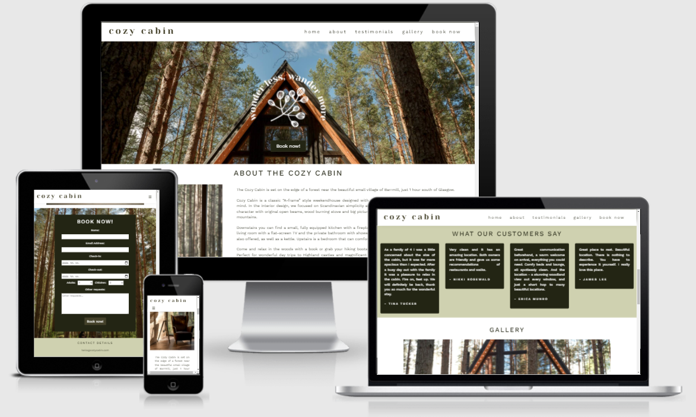
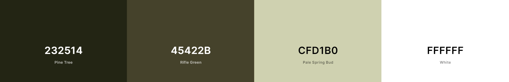
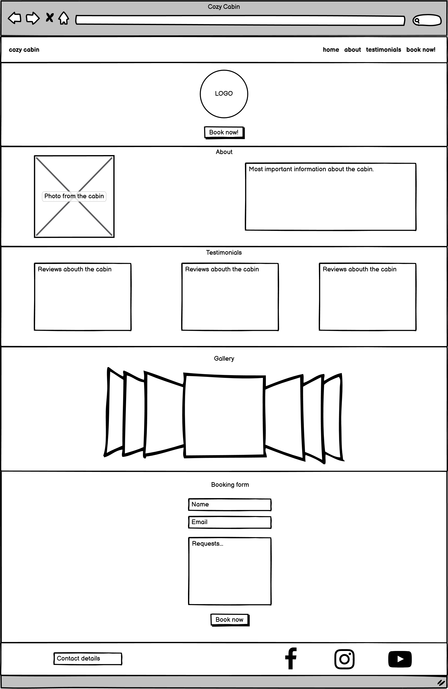
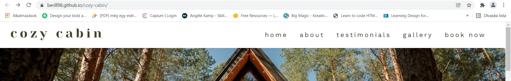
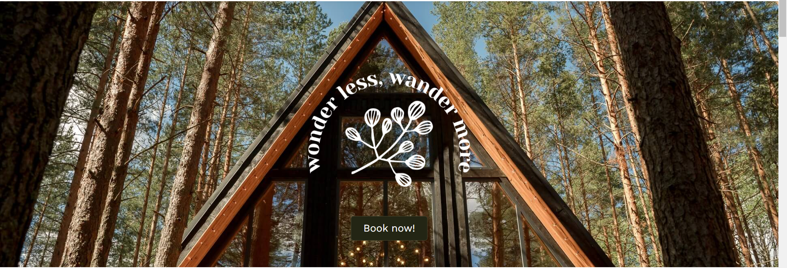
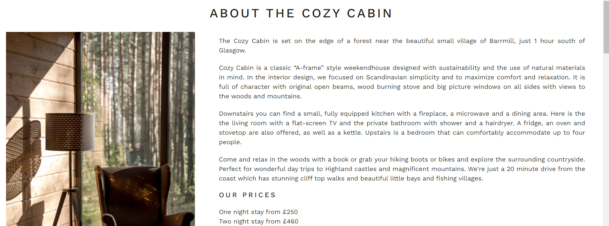
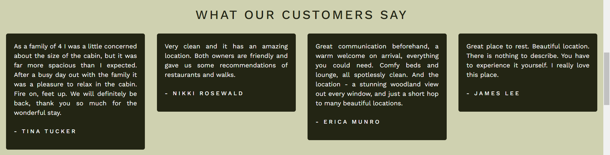
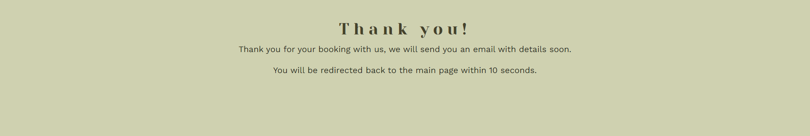
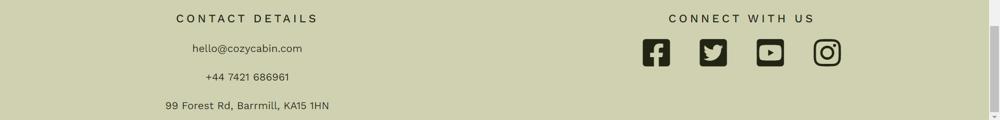

# Cozy Cabin

## The goal for this project

Welcome to the Cozy Cabin website!

Cozy Cabin is a website that aims to provide information about a fictional woodland cabin in Scotland, where the customer can feel home and connect with the nature.

The live link can be found here - [Cozy Cabin](https://berill98.github.io/cozy-cabin/)

## Site Owner Goals

- To provide the user with information about the woodland cabin.
- To present the user with a website that is easy to navigate, fully responsive and evokes a sense of calm through the use of appropriate colors and imagery.
- To enable the user to book a weekend or more in the cabin.
- To increase the number of the customers.

## User stories

- As an user I want to understand the main purpose of the site and learn about the woodland cabin. 
- As an user I want to be able to easily navigate the website and have a positive emotional experience. 
- As an user I want to be able to browse the gallery without having to sign-up / register. 
- As an user I want to be able to easily book a weekend or more in the cabin. 
- As an user I want to be able to contact and follow the cabin via social media.

## UX

### Fonts

- I have used Google Fonts to find the fonts that best suit the feel of the website. I have used [Yeseva One](https://fonts.google.com/specimen/Yeseva+One) and [Work Sans](https://fonts.google.com/specimen/Work+Sans) for the website. I used Cursive and Sans Serif as backup fonts, in case for any reason the main fonts aren't able to load correctly.

### Icons

- The icons in the footer were taken from [Font Awesome](https://fontawesome.com/).

### Colors and images

- The colours on the website are natural colors. The main colours are white, green, brown and grey. The dark fonts have a good contrast with the light green and white backgrounds making it easy to read.
- The images used on the website are very important. I used photos just from one photographer to achieve a matching effect.

### Wireframes

<b>Wireframes</b> (click to expand)

## Features

### Existing Features

- __Navigation Bar__

    - The fully responsive navigation bar includes links to the Home page, About section, Testimonials section, the gallery and the booking form and is identical to allow for easy navigation.
    - The navigation bar will allow the user to easily navigate from section to section across all devices without having to scroll back up to the top of the page or use the browser's ‘back’ button. 
    - The navigation bar has a fixed position so that it remains visible at the top of the page. It also has a shadow to make sure that it stands out.

  

- __The hero image__

    - This section includes an eye-catching photograph with text overlay and a submark logo to grab the user's attention and allow them to feel the Cozy Cabin atmosphere.
    - This section also includes a call-to-action button which helps the user booking a holiday at the cabin.

  

- __About Section__

    - This section will allow the user to read the most important information about the Cozy Cabin.
    - The user can have a look at the prices.

  

- __Testimonials section__

  - This section will allow the user to read some testimonials from other, satisfied customers. 
  - It will encourage the user to consider booking a holiday at the cabin.

  

- __Gallery__

    - The gallery will provide the user with supporting images to see what the cabin looks like both from inside and outside.

  

- __Book now! form__

  - This form will allow the user to book a weekend or more at the cabin. The user will be asked to submit their name, email address and the desired check-in and check-out dates. The user will be able give the number of guests and other requests.

  

- __Confirmation page__

  - The confirmation page will allow the user to be sure that their booking was succesful.
  - It will take the user back to the home page within 10 seconds.

  

- __The Footer__ 

  - The footer section includes contact details and links to the relevant social media sites for Cozy Cabin. The links will open to a new tab to allow easy navigation for the user. These links encourage the user to keep connected via social media.

  

### Features left to Implement

- Making a real booking system.
- 3D tour about the cabin.

## Technologies used

### Languages

- HTML5
- CSS

### Frameworks, Tools and Libraries

- [Bootstrap](https://getbootstrap.com/) - Used as a framework for the website.
- [Chrome Dev Tools](https://developer.chrome.com/docs/devtools/) - Used for overall development and testing for example the  responsiveness and appearance.
- [Font Awesome](https://fontawesome.com/) - Used for the social media icons in footer.
- [Google Fonts](https://fonts.google.com/) - Used to import fonts to the website.
- [W3C](https://www.w3.org/) - Used for validation.
- [TinyPNG](https://tinypng.com/) - Used to compress images to reduce file size without a reduction in quality.
- [Am I Responsive](http://ami.responsivedesign.is/) - Used to test responsiveness of the site on different screen sizes.
- [Autoprefixer](https://autoprefixer.github.io/) - Used to add vendro prefixes to my CSS.
- Git - Used for version control.
- [Gitpod](https://gitpod.io/) - Used as a cloud-based IDE.
- [GitHub](https://github.com/) - Used for storing code securely online.
- [GitHub Pages](https://pages.github.com/) - Used for site hosting.

## Testing

To view all testing documentation please refer to [TESTING.md](TESTING.md).

## Deployment

The site was deployed to GitHub Pages. The steps to deploy are as follows: 
  - In the [GitHub repository](https://github.com/berill98/cozy-cabin), navigate to the Settings tab 
  - From the source section drop-down menu, select the **Main** Branch, then click "Save".
  - The page will be automatically refreshed with a detailed ribbon display to indicate the successful deployment.

The live link can be found [here](https://berill98.github.io/cozy-cabin)

### Local Deployment

In order to make a local copy of this project, you can clone it. In your IDE Terminal, type the following command to clone the repository:

- `git clone https://github.com/berill98/cozy-cabin.git`

Alternatively, if using Gitpod, you can click below to create your own workspace using this repository.

## Credits

### Content

- The icons in the footer were taken from [Font Awesome](https://fontawesome.com/).

### Media

- The favicon and the "wonder less wander more" image is my own work.
- All of the photos on the website are from a photographer called [Ron Lach](https://www.pexels.com/@ron-lach).
His photos express perfectly the atmosphere I imagined for the cabin.

| Media  | Photographer  | Link |
| :------------ |:---------------:| -----:|
| Hero image | Ron Lach | [Pexels](https://www.pexels.com/photo/wood-light-landscape-vacation-9211814/) |
| About section photo | Ron Lach | [Pexels](https://www.pexels.com/photo/an-armchair-near-the-lamp-9220873/) |
| Booking form background | Ron Lach | [Pexels](https://www.pexels.com/photo/wood-dawn-landscape-vacation-9220739/) |
| Gallery - Inside | Ron Lach | [Pexels](https://www.pexels.com/photo/black-metal-framed-brown-padded-armchair-9220877/) |
| Gallery - Cabin | Ron Lach | [Pexels](https://www.pexels.com/photo/a-wooden-house-with-glass-wall-on-camping-site-9211816/) |
| Gallery - Dinner| Ron Lach | [Pexels](https://www.pexels.com/photo/healthy-man-vacation-people-9220887/) |
| Gallery - Outside | Ron Lach | [Pexels](https://www.pexels.com/photo/wood-man-vacation-people-9222083/) |
| Gallery - Yoga | Ron Lach | [Pexels](https://www.pexels.com/photo/wood-light-man-vacation-9225395/) |
| Gallery - Work | Ron Lach | [Pexels](https://www.pexels.com/photo/wood-light-restaurant-dawn-9222399/) |

### Resources used

- Inspiration for the gallery - [Bootstrap Carousel](https://getbootstrap.com/docs/4.0/components/carousel/)
- Guide for the favicon - [W3Schools](https://www.w3schools.com/html//html_favicon.asp)
- Guide for the smooth scroll effect - [W3Schools](https://www.w3schools.com/howto/howto_css_smooth_scroll.asp)
- Inspiration for the responsive Bootstrap navbar [Muhammed Fathi](https://codepen.io/Hendawy/pen/BPgNrx)

## Acknowledgments

My mentor Tim for his support and advice.