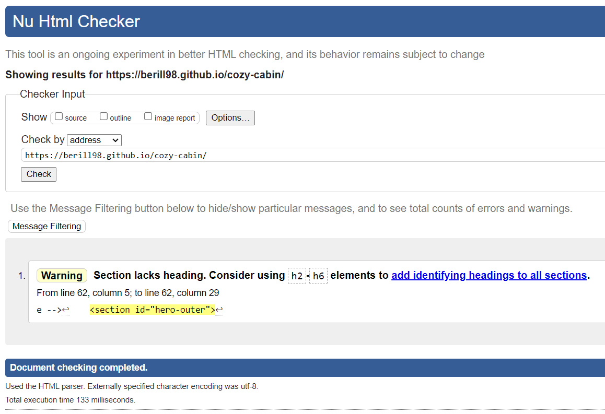
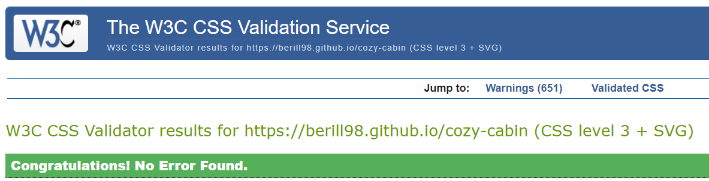
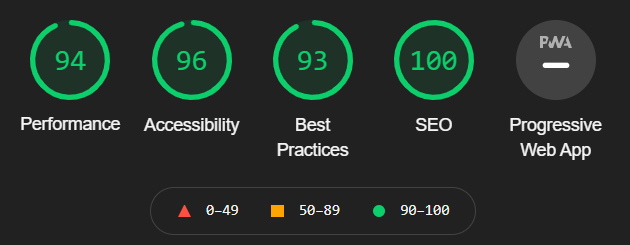
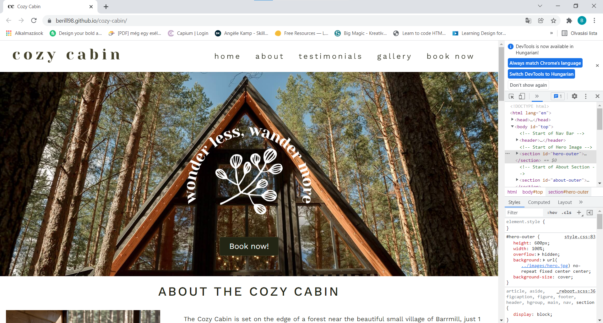
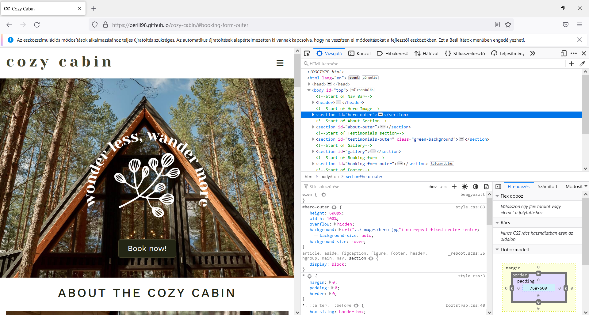
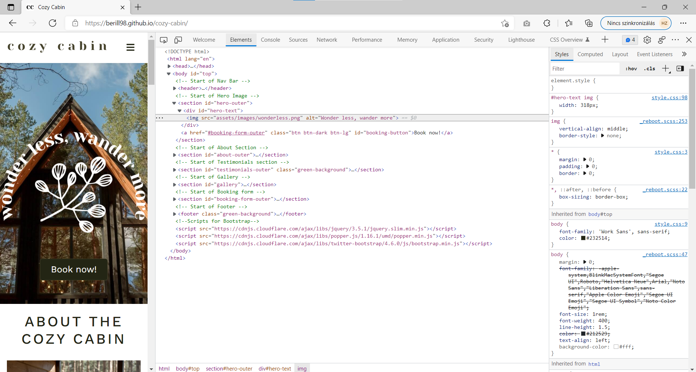
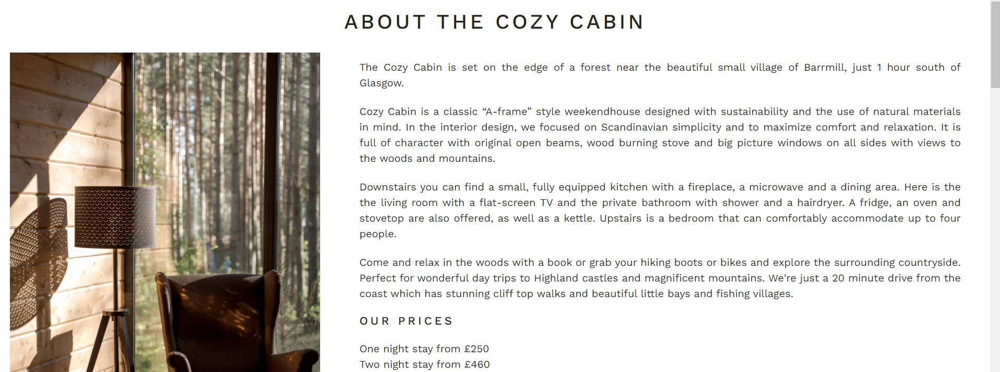
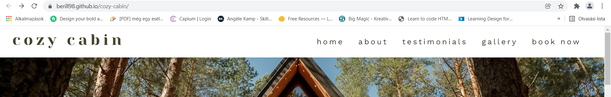
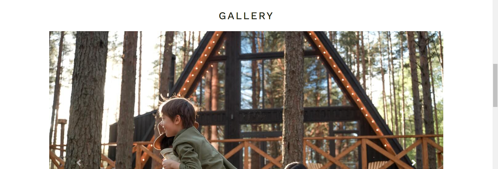
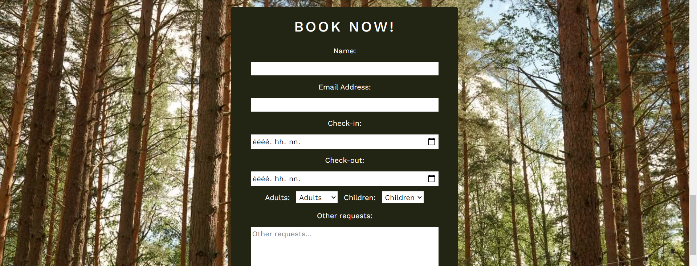

# Testing 

## Validator Testing 

- HTML
  - There were no errors however there was one warning returned when passing through the official [W3C validator](https://validator.w3.org/nu/?doc=https://berill98.github.io/cozy-cabin/).

  

- CSS
  - No errors were found when passing through the official [Jigsaw validator](https://jigsaw.w3.org/css-validator/validator?uri=https%3A%2F%2Fberill98.github.io%2Fcozy-cabin).

  

- Accessibility
  - The site achieved a Lighthouse accessibility score of 96% which confirms that the colours and fonts are easy to read and accessible.

  

## Responsiveness Testing

- The site was tested on various devices such as desktop, laptops and mobiles to ensure responsiveness. The website performed as intended. The responsive design was also checked using Chrome Developer Tools across multiple devices.

<b>Responsiveness testing</b> (click to expand)

## Browser Testing

- The site was tested on different browsers (Google Chrome, Firefox, Microsoft Edge) without issues.

<b>Browser testing</b> (click to expand)

## Form Testing

- The form was tested to ensure it is not possible to submit without the required input fields being filled in (name, email address, check-in and check-out dates), and that it navigates to the appropriate confirmation page.

## Unfixed Bugs

There are no unfixed bugs that I am aware of.

## User story testing

- As an user I want to understand the main purpose of the site and learn about the woodland cabin.

- As an user I want to be able to easily navigate the website and have a positive emotional experience. 

- As an user I want to be able to browse the gallery without having to sign-up / register. 

- As an user I want to be able to easily book a weekend or more in the cabin. 

- As an user I want to be able to contact and follow the cabin via social media.

